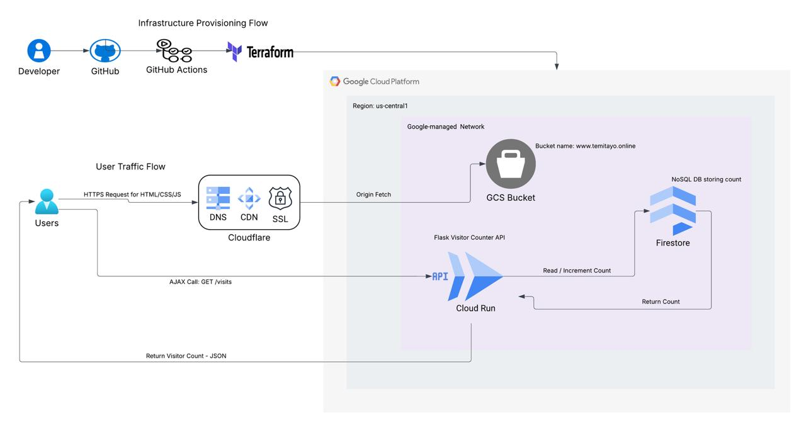
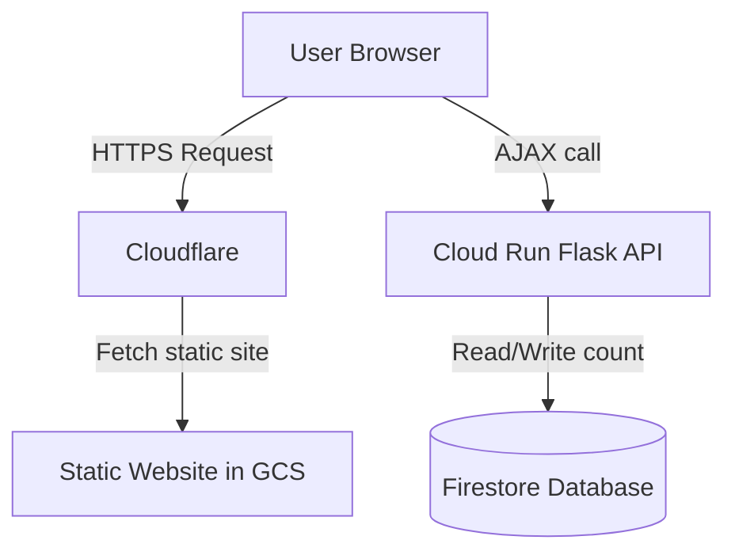
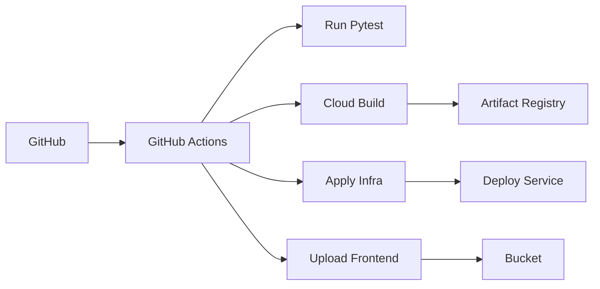

This project implements the [Google Cloud Resume Challenge](https://cloudresumechallenge.dev/docs/the-challenge/googlecloud/) on GCP. Static resume content is stored in a public GCS bucket and served behind Cloudflare (DNS + CDN + SSL). Notably, Cloudflare is used directly for DNS and CDN services, bypassing the need for Google Cloud Load Balancers. The page loads JavaScript that calls a Cloud Run–hosted Flask API to increment and return a visitor count stored in Firestore. All infrastructure (Cloud Run, IAM, APIs, etc.) is managed using Terraform, and CI/CD is automated through GitHub Actions and Cloud Build. You can view the live resume at www.temitayoapata.online.

- **Frontend:** Static resume hosted in **Google Cloud Storage (GCS)** and served via **Cloudflare** for DNS/CDN/SSL.  
- **Backend:** Python **Flask API** deployed on **Cloud Run** to handle visitor count logic.  
- **Database:** **Firestore** stores the visitor count in a native NoSQL database.  
- **Infrastructure as Code:** Managed via **Terraform**.  
- **CI/CD:** Automated with **GitHub Actions** and **Google Cloud Build** for container builds.  

High-Level Architecture

CI/CD Workflow

